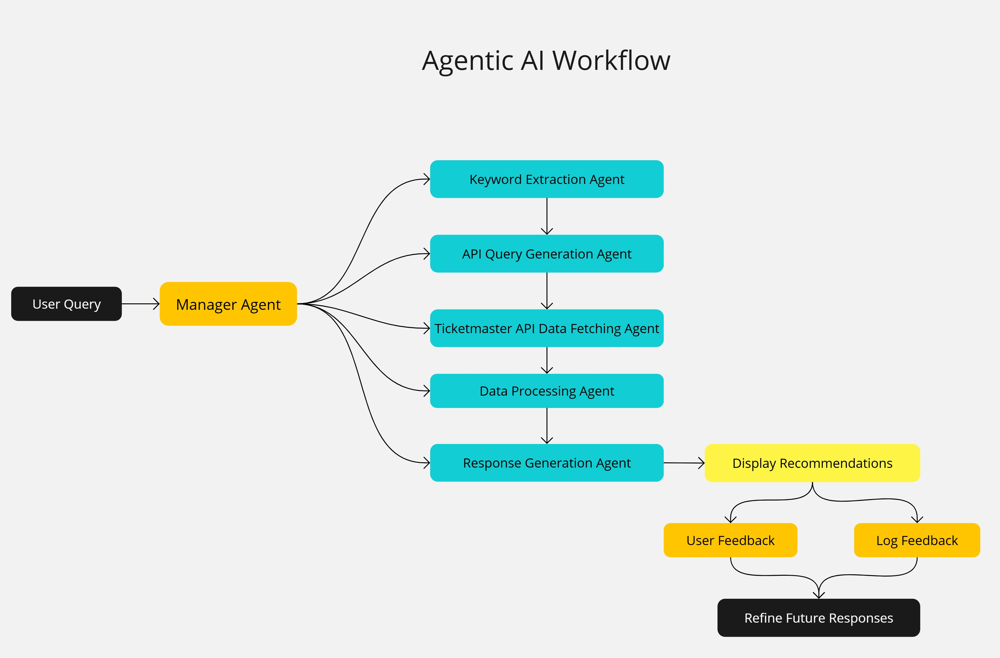

# Music Events Recommendation Assistant 🎵

## 1. App Name and Short Description
**Music Events Recommendation Assistant**  
An intelligent application designed to provide personalized music event recommendations using user preferences and external APIs like Ticketmaster. It integrates advanced AI capabilities for keyword extraction, real-time data retrieval, and response generation, ensuring a user-friendly experience.

---

## 2. Tech Stack
- **Programming Language**: Python
- **Framework**: Streamlit
- **AI**: GPT-3.5-Turbo by OpenAI for keyword extraction and response generation
- **APIs**:
  - Ticketmaster API for fetching music event data
- **Database**:
  - SQLite for storing user preferences and query history
- **Environment Management**: Python `dotenv` for environment variable management
- **Libraries**:
  - `requests` for API interaction
  - `pandas` for data manipulation
  - `uuid` for unique user identification
  - `json` for structured data handling

---

## 3. Workflow
### Agentic Workflow

This application leverages an **Agentic AI Workflow** that breaks down user queries into modular tasks handled by specialized sub-agents. Here's how the workflow operates:

1. **User Query**:
   - The user submits a query, such as:  
     *"Find Kenny G concerts in California next January."*

2. **Manager Agent**:
   - Orchestrates the workflow by assigning tasks to sub-agents and consolidating their outputs.

3. **Sub-Agents**:
   - **Keyword Extraction Agent**:
     - Extracts key components from the query, such as artist, location, and timeframe, using GPT-3.5.
     - Outputs a structured JSON query.
   - **API Query Generation Agent**:
     - Converts extracted keywords into a Ticketmaster API query.
   - **Data Fetching Agent**:
     - Retrieves real-time event data from the Ticketmaster API.
   - **Data Processing Agent**:
     - Filters and organizes the retrieved data, ensuring accuracy and clarity.
   - **Response Generation Agent**:
     - Formats processed data into a user-friendly response using GPT-3.5.

4. **Display Recommendations**:
   - Presents the generated response to the user in a structured, readable format, including event details and ticket links.

5. **User Feedback**:
   - Allows users to provide feedback on recommendations to improve the system over time.

6. **Log Feedback in Database**:
   - Stores user preferences, queries, and feedback for future improvements.

7. **Refine Future Responses**:
   - Uses stored feedback for fine-tuning and to enhance the Retrieval-Augmented Generation (RAG) process.

---

## 4. Retrieval-Augmented Generation (RAG)
This application employs **RAG principles** by:
- **Real-Time Data Retrieval**: Dynamically fetching event data from the Ticketmaster API as external knowledge.
- **LLM Integration**: Augmenting GPT-3.5's generative capabilities with real-time, domain-specific information.
- **Feedback Loop**: Leveraging stored user feedback to improve model responses over time.

---

## 5. Future Development
### Suggested Enhancements:
1. **Database Upgrade**:
   - Move from SQLite to NoSQL (e.g., MongoDB) to support vector-based retrieval for RAG workflows.
   - Consider specialized vector databases like Pinecone, Weaviate, or Milvus for better performance with embeddings.

2. **Tech Stack Migration**:
   - Replace **Python and Streamlit** with **Node.js and React** for better scalability and a more dynamic frontend experience.
   - Explore **Next.js** for SSR/CSR capabilities.

3. **Advanced LLM Integration**:
   - Upgrade from GPT-3.5-Turbo to **GPT-4** for more nuanced and contextually aware responses.
   - Consider alternatives like **Claude 3.5 Sonnet** for cost-efficiency or task-specific performance.
   - Implement hybrid models to balance cost and performance.

4. **API and Token Limit Handling**:
   - Implement logic to respect Ticketmaster API rate limits (e.g., retries and exponential backoff).
   - Optimize LLM usage by truncating or batching inputs to stay within token limits.

5. **Monitoring and Alerts**:
   - Add real-time monitoring for API usage, LLM token consumption, and error rates.
   - Create alerts for reaching API limits or high error rates.

6. **Feedback Integration into RAG**:
   - Utilize the current database of user preferences, queries, and feedback as a knowledge source for RAG workflows.
   - Integrate feedback data into fine-tuning processes to train custom models tailored to user needs.

7. **Localization**:
   - Support multi-language queries and responses to cater to a global audience.

---

## 6. Choosing the Right LLM
When selecting an LLM for this project, consider:
- **Task-Specific Needs**: Use GPT-4 for nuanced responses; use lighter models for cost-sensitive tasks.
- **Token Limits**: Larger context windows (e.g., GPT-4) allow for more detailed conversations.
- **Cost and Efficiency**: Balance model performance with API usage costs for scalability.
- **Domain-Specific Fine-Tuning**: Train models on your data for better alignment with user needs.

---

## 7. Acknowledgments
This project integrates modern AI techniques and APIs to create an intelligent, real-time recommendation system. Inspired by the power of **agentic workflows** and **RAG principles**, it aims to deliver a highly personalized user experience.
