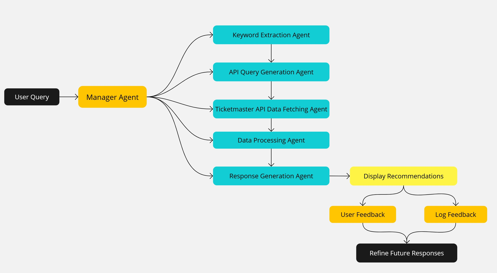

# EventGenius AI 🎵 - Prototype

## 0. Intro
This prototype is part of the capstone project from AI production management with OpenAI course, BRD is not provided here. 

## 1. Overview
**Music Events Recommendation Assistant**  
An intelligent application designed to provide personalized music event recommendations using user preferences and external APIs like Ticketmaster. It integrates advanced AI capabilities for prompt-based keyword extraction, real-time data retrieval, and response generation, ensuring a user-friendly experience.

---

## 2. Tech Stack
- **Programming Language**: Python
- **Framework**: Streamlit
- **AI**: GPT-3.5-Turbo by OpenAI for prompt-based keyword extraction and response generation
- **APIs**:
  - Ticketmaster API for fetching music event data
- **Database**:
  - SQLite for storing user preferences and query history
- **Environment Management**: Python `dotenv` for environment variable management
- **Libraries**:
  - `requests` for API interaction
  - `pandas` for data manipulation
  - `uuid` for unique user identification
  - `json` for structured data handling

---

## 3. Workflow
### Agentic Workflow with AI agent

This application leverages an **Agentic Workflow** that breaks down user queries into modular tasks handled by specialized sub-agents. Here's how the workflow operates:

1. **User Query**:
   - The user submits a query, such as:  
     *"Find Kenny G concerts in California next January."*

2. **Manager Agent**:
   - Orchestrates the workflow by assigning tasks to sub-agents and consolidating their outputs.

3. **Sub-Agents**:
   - **Keyword Extraction and API Query Generation Agent**:
     - Combines the tasks of extracting key components from the user query (such as artist, location, and timeframe) and generating a structured JSON query compatible with the Ticketmaster API.
     - Uses GPT-3.5 with carefully crafted prompts to infer the user input and directly output the JSON for the next step.
   - **Data Fetching Agent**:
     - Retrieves real-time event data from the Ticketmaster API.
   - **Data Processing Agent**:
     - Filters, organizes, and ensures the accuracy of retrieved data.
   - **Response Generation Agent**:
     - Formats processed data into a user-friendly response using GPT-3.5 and specialized prompts.

4. **Display Recommendations**:
   - Presents the generated response to the user in a structured, readable format, including event details, ticket links, and images.

5. **User Feedback**:
   - Collects user input on recommendations to enhance system quality and personalization.

6. **Log Feedback in Database**:
   - Stores user preferences, queries, and feedback for future improvements.

7. **Refine Future Responses**:
   - Uses stored feedback for fine-tuning and to enhance the Retrieval-Augmented Generation (RAG) process.

---

## 4. Retrieval-Augmented Generation (RAG)
This application employs **RAG principles** to enhance response accuracy and personalization:
- **Real-Time Data Retrieval**: Dynamically fetches event data from the Ticketmaster API as external knowledge.
- **LLM Integration**: Augments GPT-3.5's generative capabilities with prompt-based, real-time, domain-specific information.
- **Feedback Loop**: Leverages stored user feedback to improve model responses over time.

---

## 5. POC
https://www.loom.com/share/ab5c51d4e8704a12a23fb6f74fdf9c46?sid=3cee1c8c-c10c-4cd3-b9f3-518f1c2bb52f

---

## 6. Future Development
### Suggested Enhancements:
1. **Database Upgrade**:
   - Transition from SQLite to NoSQL (e.g., MongoDB) for scalability.
   - Use vector databases like Pinecone or Milvus for efficient RAG workflows.

2. **Tech Stack Migration**:
   - Replace **Python and Streamlit** with **Node.js and React** for a scalable and dynamic user interface.
   - Consider **Next.js** for advanced server-side rendering (SSR).

3. **LLM Advancements**:
   - Upgrade to **GPT-4** for better contextual understanding.
   - Explore cost-effective alternatives like **Claude** for specific tasks.
   - Implement hybrid models to balance cost with performance.

4. **API and Token Efficiency**:
   - Implement strategies to manage Ticketmaster API rate limits, such as retries and exponential backoff.
   - Optimize LLM queries to reduce token usage and ensure cost efficiency.

5. **Monitoring and Alerts**:
   - Incorporate tools like Prometheus or Grafana to monitor API usage and error rates.
   - Enable real-time alerts for API limit breaches or system issues.

6. **Feedback-Driven RAG**:
   - Integrate stored user feedback into the RAG pipeline for personalized response refinement.
   - Use feedback to train domain-specific fine-tuned models.

7. **Localization**:
   - Enable support for multi-language queries and responses to cater to a diverse global audience.

8. **Data Source Diversification**:
   - Expand beyond Ticketmaster by integrating APIs from other ticketing and event platforms (e.g., Eventbrite, Bandsintown, or Songkick) to provide more comprehensive coverage of artists and music events globally.
   - Implement intelligent aggregation and deduplication to combine data from multiple sources seamlessly, ensuring the highest quality and consistency of event information.

---

## 7. Choosing the Right LLM
When selecting an LLM for this project, consider:
- **Task-Specific Requirements**: Use GPT-4 for detailed, nuanced responses; use lightweight models for simpler tasks.
- **Token Limits**: Larger context windows (e.g., GPT-4) allow for more complex queries and detailed outputs.
- **Cost vs. Performance**: Optimize model selection to balance costs with system efficiency.
- **Domain-Specific Fine-Tuning**: Train models on user-specific data to improve alignment and personalization.

---

## 8. Acknowledgments
This project integrates modern AI techniques and APIs to create an intelligent, real-time recommendation system. Inspired by the power of **agentic workflows**, **RAG principles**, and **prompt engineering**, it aims to deliver a highly personalized user experience.
